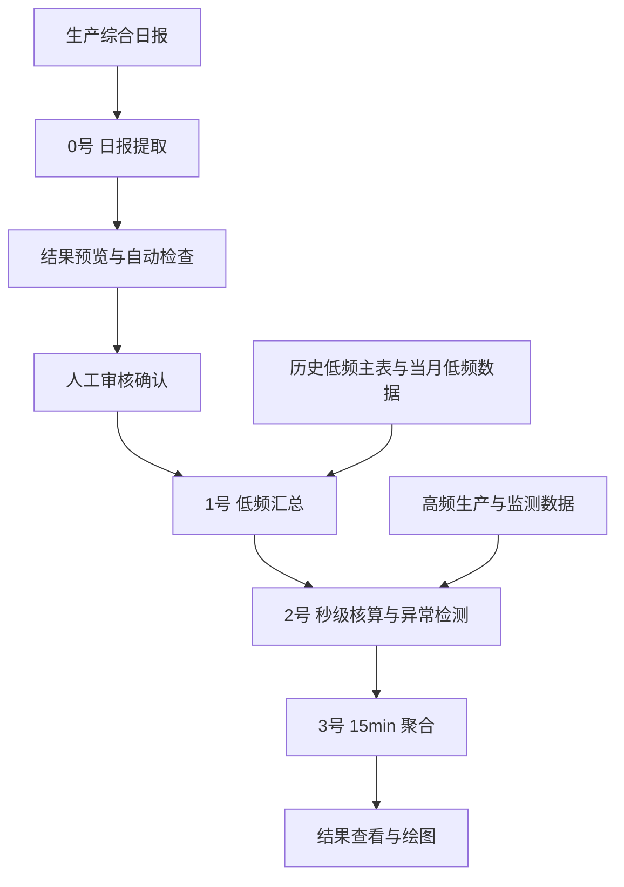
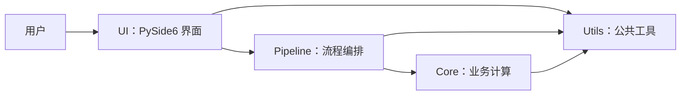

# 清华数据分析软件

基于 **Python + PySide6** 的科研数据处理桌面软件，用于海螺水泥碳排放数据的提取、审核、核算、聚合与可视化。

将生产日报、低频台账和高频监测数据串联为可检查的数据处理流程，减少人工整理，并同时提供排放结果与数据质量检查结果。

**版本：1.0.0 / 詹宇轩1.0版** · **处理范围：单月内指定日期区间** · **运行方式：本地桌面**

## 功能概览

| 环节 | 主要能力 |
| --- | --- |
| 0号：日报提取与审核 | 提取生产日报，预览结果，自动检查并独立进行人工确认 |
| 1号：低频汇总 | 合并历史主表、日报结果及当月低频数据 |
| 2号：秒级核算 | 秒级碳排放核算与异常检测 |
| 3号：15min 聚合 | 聚合秒级结果，生成后续分析使用的结果文件 |
| 项目配置 | 选择数据项目根目录，自动识别当月输入文件 |
| 一键运行 | 人工审核通过后，后台执行 1→2→3，并展示进度 |
| 结果与追溯 | 结果文件查看、15min 分类图表、运行记录 |

PySide6 源码面向 macOS / Windows 桌面环境；打包产物不在本仓库内，各平台发布前需独立验证。

## 数据处理流程



**自动检查通过不等于人工审核通过。** 只有对当前结果完成明确的人工确认，才允许一键运行后续流程。重新提取或修改处理范围后需要重新审核。

## 软件界面

左侧导航包含：**工作台、项目配置、0号 日报提取与审核、一键运行、结果查看、运行记录、使用说明**。结果查看中提供结果文件列表和 15min 分类图表。

当前仓库暂未收录经过核验、脱敏的软件截图，因此不使用示意图替代真实界面。后续截图的存放位置与检查要求见[目录与维护说明](docs/仓库维护说明.md)。

## 环境与启动

使用 **Python 3.11**。主要运行依赖为 PySide6、pandas、numpy、matplotlib、openpyxl、xlrd 和 tqdm；PyInstaller 仅用于可选打包。

在项目根目录执行：

### macOS / Linux

```bash
python3.11 -m venv .venv
.venv/bin/python -m pip install -r requirements.txt
.venv/bin/python main.py
```

### Windows

```bat
py -3.11 -m venv .venv
.venv\Scripts\python.exe -m pip install -r requirements.txt
.venv\Scripts\python.exe main.py
```

激活虚拟环境后，也可直接使用 `python main.py`。程序打开桌面窗口，不启动浏览器服务。

`requirements-lock.txt` 是已有 macOS arm64 打包环境的版本记录，并非通用跨平台锁文件。日常安装使用 `requirements.txt`；Linux 桌面兼容性和各平台打包效果需在目标环境验证。

## 软件架构



UI 负责输入、状态和交互，Pipeline 负责后续流程顺序与失败中断，Core 保留业务计算。Utils 提供配置、路径、日志、审核状态和图表等公共能力。该图概括主流程，单步页面也会直接调用相应业务入口。

## 项目结构

```text
清华数据分析软件/
├── main.py                 桌面入口
├── core/                   业务计算与 pipeline.py
├── ui/                     界面、后台运行与进度展示
├── utils/                  公共工具
├── assets/                 Logo、图标、思维导图 PNG
├── config/                 空路径配置模板与版本信息
├── docs/                   仓库与开发维护说明
├── scripts/                开发辅助工具
├── packaging/              打包配置与平台测试说明
├── tests/                  自动化测试
├── requirements.txt        运行依赖
├── requirements-lock.txt   已有 Mac 打包环境版本记录
└── README.md
```

完整的文件分类和保留原则见[目录与维护说明](docs/仓库维护说明.md)。

## 数据说明

首次启动，在“项目配置”中选择**自己的数据项目根目录**、处理月份和输入文件。软件根据配置识别输入，并按现有标准目录体系保存结果。

仓库只保存代码、必要资源和文档，**不提供实际科研数据**。用户配置、运行日志、原始 Excel、秒级结果和 15min 结果均不应提交。配置模板位于 `config/default_config.json`；实际配置和日志由路径工具保存至系统用户目录。

运行前核对数据、日期区间和覆盖风险，运行后在“结果查看”和“运行记录”中核验结果。

## 开发说明

项目从原始 Python 脚本，经 Streamlit 原型验证，演进为当前 PySide6 桌面软件。旧原型不属于此仓库，当前版本不以 Streamlit 为入口。

在已激活的虚拟环境中进行基础检查：

```bash
python -m compileall main.py core ui utils tests
python -m unittest discover -s tests
python -m pip check
```

无显示器环境可设置 `QT_QPA_PLATFORM=offscreen`。测试应使用临时数据，不运行正式整月计算。

现有 Mac spec 和[另一台 Mac 测试说明](packaging/另一台Mac测试说明.md)保留在 `packaging/`。打包与源码整理分开进行，不因整理文档更改业务公式或重建现有 App。
