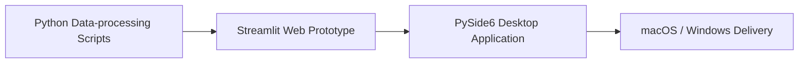

# Research Projects at the Energy Internet Research Institute, Tsinghua University

**EIRI, THU · Research & Engineering Projects**

This repository documents selected research and engineering projects developed during my work at the Energy Internet Research Institute, Tsinghua University (EIRI, THU).

This is a personal project repository and is not an official repository of Tsinghua University or EIRI.

## Projects

### 1. Boiler Operating Condition Analysis

Data-driven analysis and identification of boiler operating conditions using historical operational data.

The workflow joins daily 15-minute records, checks data quality, matches required fields, constructs a complete timeline, and produces an analysis-ready summary. It then uses robust statistics, rule-based event detection, adaptive parameter calibration, change-point identification, and stability checks to divide continuous operating-condition periods and generate condition maps and evidence tables.

[Project source and usage](boiler-operating-condition-analysis/README.md)

### 2. Conch Cement Carbon Data Analysis — Streamlit Prototype

An early Streamlit-based web prototype used to validate the carbon-emission data-processing workflow and interaction design. It connects report extraction, low-frequency aggregation, second-level calculation, 15-minute aggregation, path configuration, result inspection, and charting in a browser-based interface.

This directory is the historical **prototype**, not an API and not the current desktop application.

[Prototype source and usage](conch-cement-streamlit-prototype/README.md)

### 3. Conch Cement Carbon Emission Data Analysis App

A PySide6 desktop application that turns the validated workflow into a standalone research tool with project configuration, automatic path detection, result preview, automatic validation, explicit manual review, background workflow execution, result inspection, 15-minute visualization, and run history.

[Desktop application source, screenshots, and documentation](conch-cement-carbon-data-analysis-app/README.md)

## Software Evolution



| Stage | Purpose |
| --- | --- |
| Scripts | Validate scientific calculations and file-processing steps |
| Streamlit | Validate the end-to-end software workflow and interaction model |
| PySide6 | Engineer the workflow into a structured local desktop application |
| macOS / Windows | Prepare tested, platform-specific delivery builds |

Packaged applications, local environments, user configuration, and research data are not stored in this source repository.

## Repository Structure

```text
eiri-thu-projects/
├── README.md
├── docs/
│   └── MIGRATION.md
├── boiler-operating-condition-analysis/
├── conch-cement-streamlit-prototype/
└── conch-cement-carbon-data-analysis-app/
```

Each project includes its own scope, environment, and usage notes. Data files are excluded due to project confidentiality and size considerations.

## Research Focus

- Energy data analysis
- Carbon-emission accounting
- Industrial data processing
- Scientific software development
- Data visualization

## Organization and Scope

Energy Internet Research Institute, Tsinghua University (EIRI, THU).

This is Felix / Yuxuan Zhan's personal project repository documenting research and engineering work conducted during a research/internship experience. It is not an official repository or software release of Tsinghua University or EIRI.

See [migration provenance](docs/MIGRATION.md) for source locations, history handling, and excluded artifacts. No open-source license has been added.
