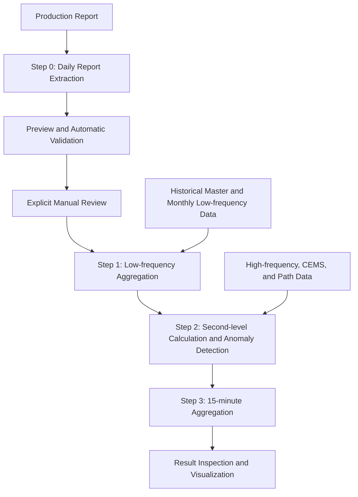
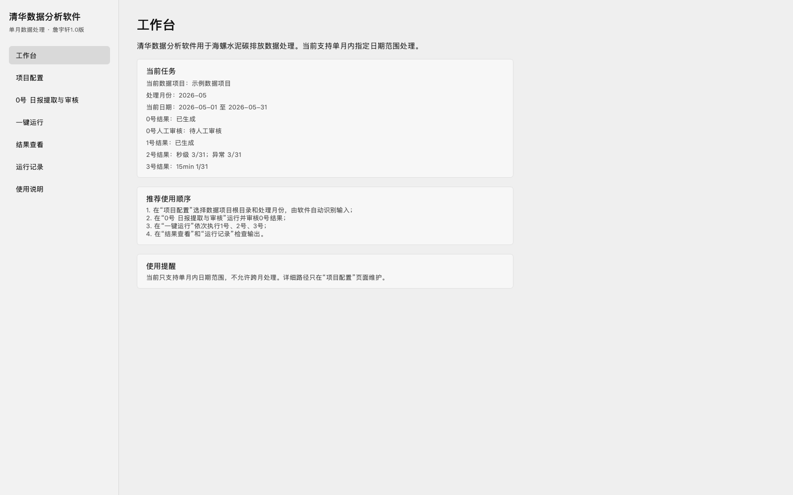
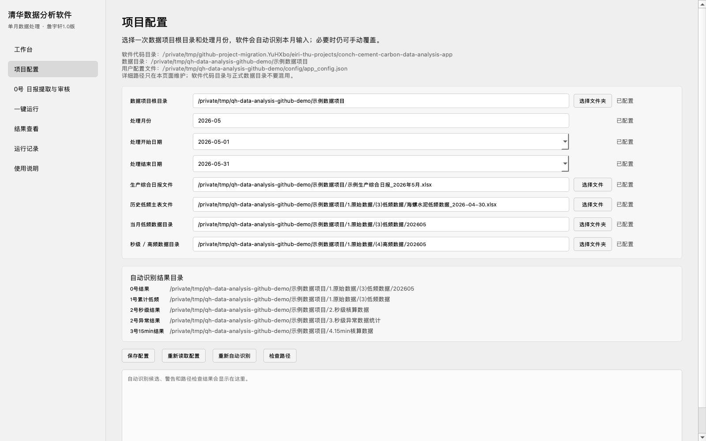
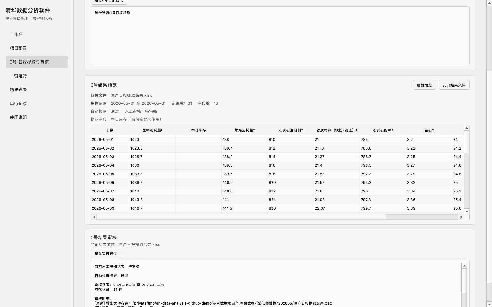
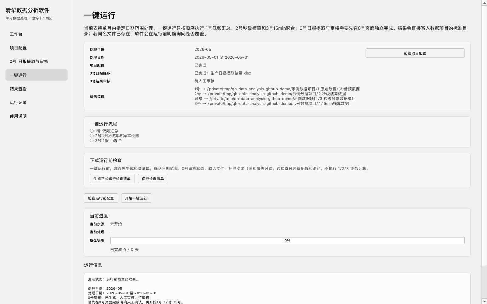
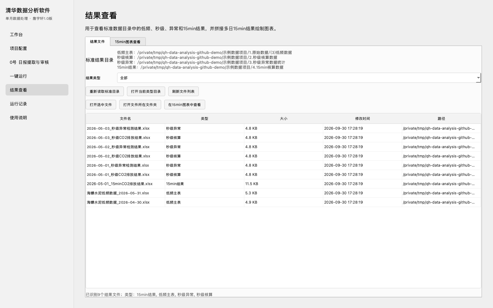
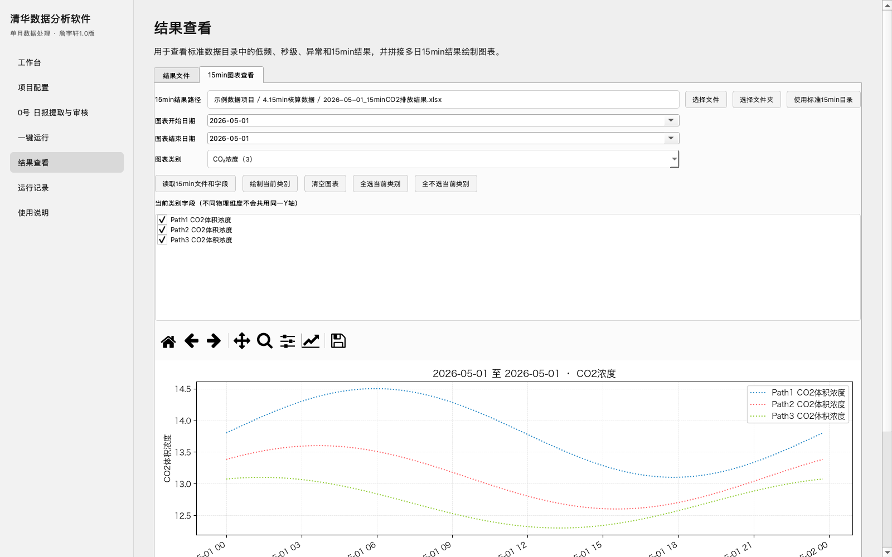
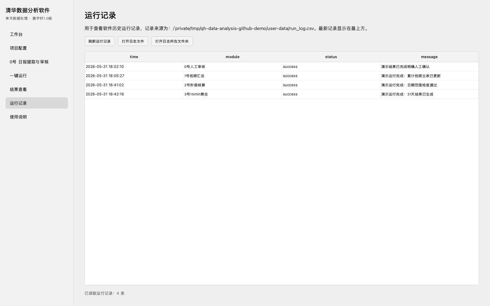
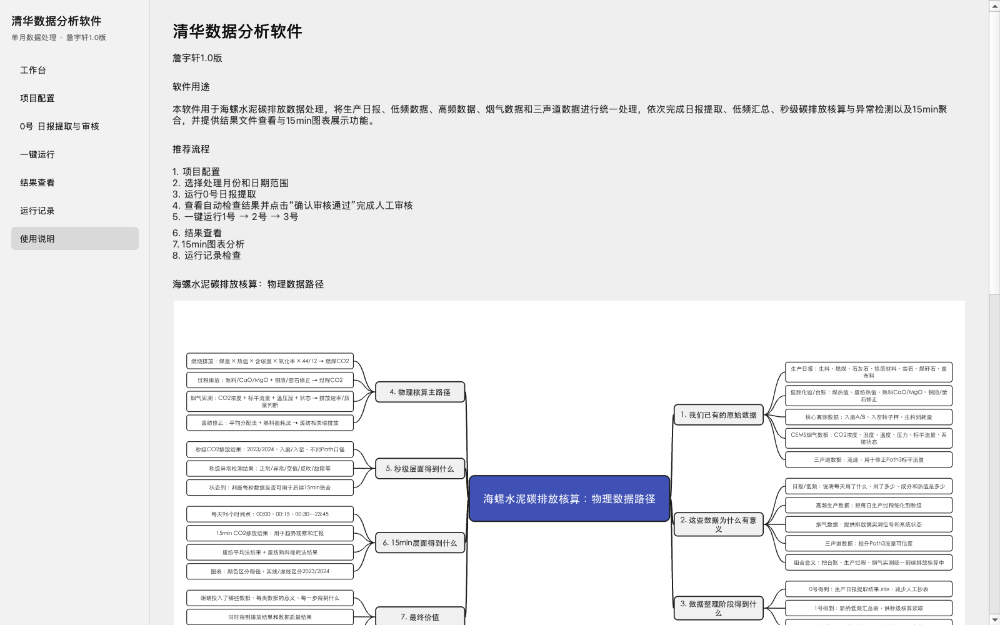
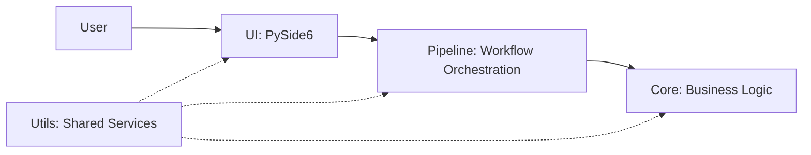

# Conch Cement Carbon Emission Data Analysis App

**清华数据分析软件** is a Python + PySide6 desktop application for extracting, reviewing, calculating, aggregating, and visualizing carbon-emission data in a cement-production research workflow.

**Version:** 1.0.0 / 詹宇轩1.0版 · **Scope:** a selected date range within one month · **Runtime:** local desktop application

## Overview

The application turns a sequence of research scripts and Excel-processing steps into an explicit, inspectable workflow. It manages project paths, keeps automatic checks separate from human approval, runs downstream processing in the required order, and provides a single place to inspect output files, charts, and run history.

## Workflow



Automatic validation does not equal human approval. A current Step 0 result must be explicitly reviewed before the Step 1 → 2 → 3 pipeline is enabled.

## Features

- Project configuration and automatic monthly file/path detection
- Step 0 production-report extraction
- Result preview and automatic validation
- Explicit manual review before downstream processing
- One-click Step 1 → 2 → 3 workflow
- Background worker and responsive progress display
- Result file browser and system file opening
- 15-minute chart categories and field selection
- Run history and built-in usage documentation
- Source and packaging support for macOS and Windows

## Screenshots

The screenshots below are rendered by the real PySide6 application using an isolated, privacy-safe demonstration state. They do not contain industrial source data, user configuration, or production results.

### Dashboard



<table>
  <tr>
    <td width="50%"><strong>Project Configuration</strong><br></td>
    <td width="50%"><strong>Step 0 — Extraction & Review</strong><br></td>
  </tr>
</table>

### Automated Pipeline



### Results & Visualization

<table>
  <tr>
    <td width="50%"><strong>Result Browser</strong><br></td>
    <td width="50%"><strong>15-minute Charts</strong><br></td>
  </tr>
  <tr>
    <td width="50%"><strong>Run History</strong><br></td>
    <td width="50%"><strong>Built-in Documentation</strong><br></td>
  </tr>
</table>

## Architecture

The project separates interface code, workflow orchestration, scientific processing, and shared utilities. The UI calls established Core entry points and does not reimplement scientific formulas.

- [Project Overview](docs/PROJECT_OVERVIEW.md)
- [Software Architecture](docs/ARCHITECTURE.md)
- [Data Flow](docs/DATA_FLOW.md)



## Technology Stack

- Python 3.11
- PySide6
- pandas and NumPy
- Matplotlib
- openpyxl and xlrd
- PyInstaller for platform-specific packaging

## Project Structure

```text
conch-cement-carbon-data-analysis-app/
├── main.py
├── core/                   Business calculations and pipeline
├── ui/                     Desktop pages, worker, and progress display
├── utils/                  Paths, configuration, logs, review, and charts
├── assets/                 Logo, icons, and bundled visual resources
├── config/                 Default configuration and version metadata
├── docs/                   Project documentation and screenshots
├── scripts/                Development support scripts
├── packaging/              Platform packaging configuration
├── tests/                  Automated tests
├── requirements.txt
└── README.md
```

## Running from Source

Use Python 3.11.

### macOS / Linux

```bash
python3.11 -m venv .venv
.venv/bin/python -m pip install -r requirements.txt
.venv/bin/python main.py
```

### Windows

```bat
py -3.11 -m venv .venv
.venv\Scripts\python.exe -m pip install -r requirements.txt
.venv\Scripts\python.exe main.py
```

The program opens a local desktop window and does not start a browser service. `requirements-lock.txt` records an existing macOS arm64 packaging environment; use `requirements.txt` for a new cross-platform source environment.

## Notes on Data

Actual industrial data is not included in this repository. Data files are excluded due to project confidentiality and size considerations.

Users select their own data-project root and processing month in **Project Configuration**. Local configuration, run logs, source workbooks, second-level results, anomaly results, and 15-minute outputs remain outside the source repository.

## Evolution

This desktop application evolved from the earlier [Conch Cement Carbon Data Analysis — Streamlit Prototype](../conch-cement-streamlit-prototype/). The prototype established the workflow and interaction model; the PySide6 application added desktop architecture, configuration management, manual review, background execution, result inspection, and platform delivery support.

## Development Checks

```bash
python -m compileall main.py core ui utils tests
python -m unittest discover -s tests
python -m pip check
```

Use temporary or synthetic data for interface tests. Do not run production calculations as part of documentation maintenance.
