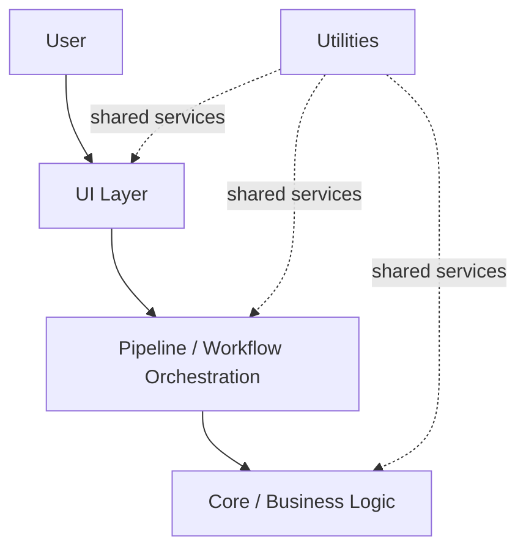

# Software Architecture

## UI Layer

The PySide6 UI is responsible for:

- Pages and navigation
- Buttons and confirmation dialogs
- Tables and result previews
- File and folder selection
- Charts
- Progress and state display

The UI does not reimplement scientific formulas. It validates interaction state and calls established processing entry points.

## Pipeline

The pipeline coordinates Step 1 → Step 2 → Step 3 after a current Step 0 result has been explicitly approved. It passes output paths between stages, reports progress, records status, and stops later stages when a required step fails.

## Core

Core contains the processing implementations for:

- Step 0 production-report extraction
- Step 0 result validation
- Step 1 low-frequency aggregation
- Step 2 second-level carbon-emission calculation
- Anomaly detection
- Step 3 15-minute aggregation

Core focuses on defined inputs, processing, and outputs. Scientific formulas and validated mappings remain in this layer.

## Utils

Utilities provide shared services for:

- Cross-platform paths
- User configuration
- Run and detail logs
- Excel helpers
- Runtime resource handling
- Date ranges and standard result paths
- Automatic project-file detection
- Step 0 previews and review state
- 15-minute chart loading and field grouping

## Runtime Data Boundaries

The source repository contains code, resources, configuration templates, and tests. User configuration and logs use operating-system user directories. Industrial workbooks and generated results stay in the user-selected data project and are not bundled with the application source.
