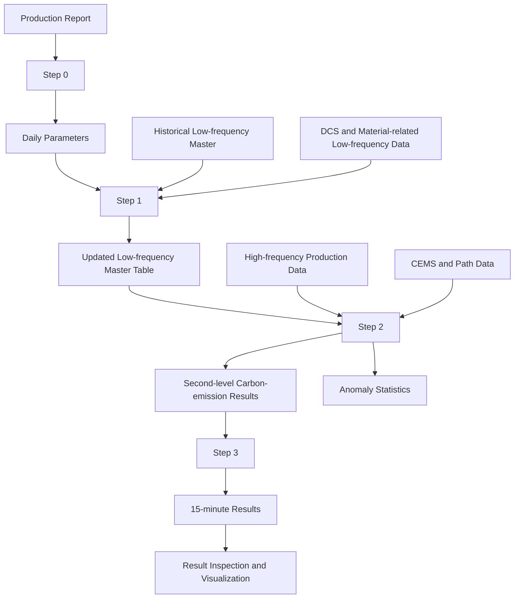

# Data Flow

No production data is included in this repository. The diagram uses abstract data categories to document how files move through the application.

## Step 0 — Production Report Extraction

**Input:** production report workbook

**Output:** production report extraction result

**Purpose:** prepare daily-scale parameters, preview the extracted records, run structural and date checks, and support explicit human review before downstream processing.

## Step 1 — Low-frequency Aggregation

**Input:** historical low-frequency master, Step 0 result, and DCS/material-related low-frequency data

**Output:** updated cumulative low-frequency master

**Purpose:** update the target date range while retaining the established low-frequency table structure required by second-level calculation.

## Step 2 — Second-level Calculation

**Input:** low-frequency parameters, high-frequency production data, CEMS measurements, and Path1 / Path2 / Path3 data

**Output:** second-level carbon-emission results and anomaly statistics

**Purpose:** align daily parameters with second-level process measurements, calculate the existing emission paths, and identify records that require data-quality attention.

## Step 3 — 15-minute Aggregation

**Input:** second-level results

**Output:** 15-minute results, normally 96 time points for a complete natural day

**Purpose:** produce analysis-ready time series for trend inspection and charting while preserving the established aggregation rules.

## Repository Data Policy

Data files are excluded due to project confidentiality and size considerations. The repository documents expected categories and interfaces without storing source workbooks, CEMS data, high-frequency records, or generated production results.
